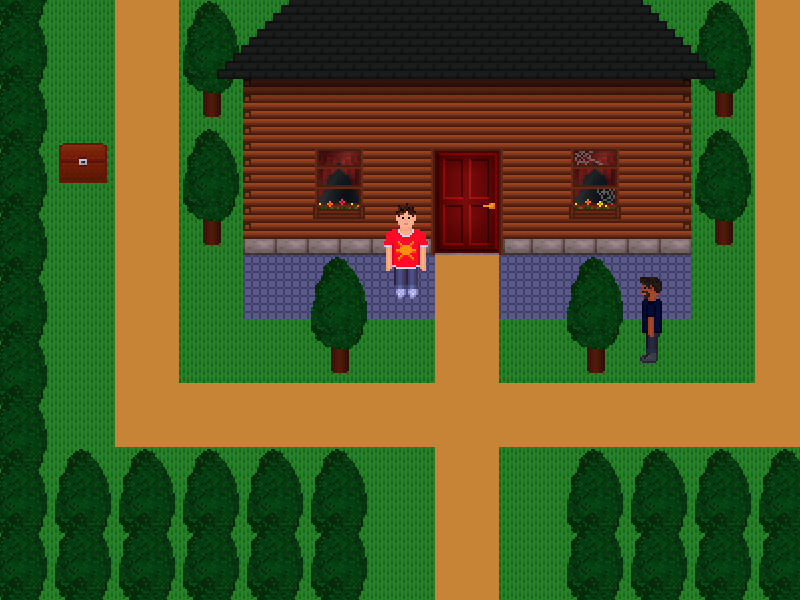

# RPG
Author: [paulpls](https://github.com/paulpls)  
License: [GPL 3.0](LICENSE.md) (Third-party modules may not fall under this license; see [license info](#license-information))

## About
A simple RPG prototype for the LÖVE framework, created as proof-of-concept.

## How to Play
Use the arrow keys to explore the world around you and collect loot.

## Installation & Runtime
- Install [LÖVE](https://www.love2d.org)
- Clone the repo and `cd` into it
- Run `love .`

## Controls
| Input      | Description  |
|:----------:|:-------------|
| Arrow keys | Move player  |
| Spacebar   | Interact     |
| q, ESC     | Quit         |
| j, k       | Health -/+   |

## License Information
  
    Copyright (C) 2023 Paul Clayberg
    
    This program is free software: you can redistribute it and/or modify
    it under the terms of the GNU General Public License as published by
    the Free Software Foundation, either version 3 of the License, or
    (at your option) any later version.
    
    This program is distributed in the hope that it will be useful,
    but WITHOUT ANY WARRANTY; without even the implied warranty of
    MERCHANTABILITY or FITNESS FOR A PARTICULAR PURPOSE.  See the
    GNU General Public License for more details.
    
    You should have received a copy of the GNU General Public License
    along with this program.  If not, see <https://www.gnu.org/licenses/>.

**NOTE:** This project includes some libraries that are licensed under the GPL-compatible MIT License, and are subject to their own copyright as defined therein. Please review each library's license for more details.

